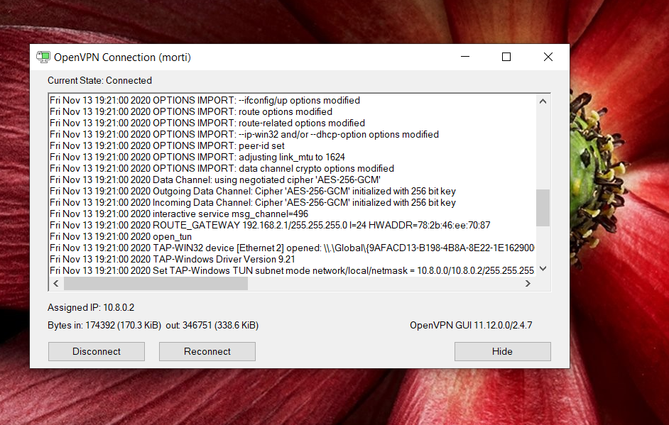

# OpenVPN
# L'INSTALLATAION D'OPENVPN SUR NOTRE SERVEUR ET NOTRE OPENVPN CLIENT #

:pushpin: Dans ce fichier, je vais vous expliquer comment installer OpenVPN-server et sur votre serveur, apres le configurer pour recevoir un script dans lequel il y a des clées codées, 
  avec lequel, votre OpenVPN -client peut se connecter à ce serveur sur une connexion point-to-point. après je vous explique comment préparer votre ordinateur pour être capable   de se connecter à son serveur.
 
 :pushpin: À la fin, je vais vous montrer comment vous assurer que vous êtes connecté à votre serveur à partir de votre OpenVPN en utilisant:
 
 :pushpin: 1- La commande TRACERT
 
 :pushpin: 2- Firewalld. D'abord je vous explique comment installer firewalld sur votre serveur,et comment le configurer. Et après, le configurer d'une manière que seulement une           spécifique address IP ait l'autorité de le conneceter. À la suite, vous utilisez SSH et l'address IP de l'interface de votre OpenVPN pour vous connecter à votre serveur.
 

 :star: D'abord en utilisant les commmandes suivantes on va recevoire les derniers mis à jours.
 
 :~$ sudo apt-get update
 
 :~$ sudo apt-get upgrade
 
 
 

:star: En utilisant ce commande on peut télécharger le script d'installation de OpenVPN:

:~$ wget https://git.io/vpn -O openvpn-ubuntu-install.sh

:star: Maintenant on va changer le mode scrip pour le rendre executable: 

:~$ chmod -v +x openvpn-ubuntu-install.sh

:star: on peut vérifier le contenu du fichier en utilisant nano ou vi: 

:~$ nano openvpn-ubuntu-install.sh

:star: executer le script pour installer le serveur OpenVPN 

:~$ sudo ./openvpn-ubuntu-install.sh

:star: D'abord vous devevez choisir que quelle adresse IP sera utilisée par votre client OpenVPN pour se connecter au serveur.
   Dans ce cas, mon client utilisera 10.13.237.100.
   Après vous pouvez vérifier que votre adresse IP pulic sera utilisé afin que votre serveur soit capable de se connecter à l'internet.
   dans l'étape suivante, vous devez choisir votre DNS server.
   Maintenant, vous devez écrire le nom de votre utilisateur, et ça va devenir le nom de script qui sera créé par votre serveur, avec lequel, votre clien      sera capable de se connecter à ce serveur. Dans ce cas, j'ai écrit (morti).
   
   
   

:star: Une fois que la configuration sera terminé, vous pouvez vérifier dans les deux dernières lignes, le chemain pour avoir au script créé par votre serveur      pour votre clien nomé morti.ovpn. oon va l'utiliser pour importer ce script dans notre client-OpenVPN.
  
  
  
 
  
:star: Maintenant votre Openvpn-serveur ets prêt, et vous pouvez vérifier son statut en utilisant la commande suivante:
  
:star: sudo systemctl status openvpn-server@server.service

:star:le statut du serveur, c'est active(running) 

:pushpin: pour changer le statut de votre serveur, vous pouvez utiliser les commandes suivantes selon vos besoins:

:star: ~$ sudo systemctl start openvpn-server@server.service
#: 
:star: ~$ sudo systemctl restart openvpn-server@server.service
#:
:star: ~$ sudo systemctl stop openvpn-server@server.service
 
 

:star:Le moment où, vous configuré votre serveur OpenVPN avec le script openvpn-ubuntu-install.sh, une spécifique interface sera configuré pour votre connexion,
le status de cette interface sera point-to-point, et utilise l'adresse IP de l'intervalle 10.8.0.0/24.
on peut le vérifier avec la commandeci-dessous:

:star:~$ ip addr

:pushpin: Maintenant, on doit installer OpenVPN sur la machine de notre client:

:pushpin: sur Windows, oo peut utiliser:

 choco install openvpn 

:pushpin: sur Linux, on peut utiliser:

:pushpin: sudo apt-get install openvpn

:pushpin: sudo apt-get install network-manager-openvpn

:pushpin: Maintenant c'est le moment d'arriver à notre serveur et prendre notre script de configuration.
 Dans notre machine client-serveur, en utilisant cette commande, on arrive à notre serveur en utilisant Gitbash, et on copie ce fichier dans notre machine:

:pushpin: ssh morti@10.13.237.100 "sudo -S cat /root/morti.ovpn" > morti.ovpn
 
 
 
 
 
 
 
 
:pushpin: Maintenant, d'abord il faut touver ce fichier sur votre ordinateur:
 
 
 
 
 
:pushpin: À la suite, il faut le mettre dans le fichier de config de votre OpenVPN.
 
 
 
  
  
  
 
:pushpin: Faites clique droit sur l'application de OpenVPN, cliquez sur Properties, et cochez les option comme la photo suivante.
   
   
   
   
   
   
    
   
   
:pushpin: Maintenant, OpenVPN va créer connexion entre votre ordinateur et votre serveur en utilisant ce fichier: 
 
 
  
  
  
:pushpin: Dès que la connexion est établie, vous pouvez vérifier votre address IP, et l'interface Point-to-point créée dans l'intervalle 10.8.0.0/24
  
  
   
   
 
:pushpin: vous pouvez toujours vérifier le statut de votre OpenVPN en cliquant sur :
 
 
   
 
 
:pushpin: en utilasant la commande ifconfig, vous pouvez vous assurer que vous avez reçu la bonne adresse IP:  
 
 
    
 
 
:pushpin: en utilisant la commande tracert et addresse Ip de l'interface de votre serveur, vous pouvez vous assurer que c'est une connection point-to-point.
 
  
 
 
:pushpin: Maintenat, on va installer firewalld sur notre serveur.
 
 
 
 
:pushpin: on peut vérifier le statut de notre firewall en utilisant la commande suivante:
 
  
 
 
:pushpin: il y a deux méthodes pour donner l'autorité à un spécifique protocole pour passer de notre firewall, soit par son numéro de porte, soit par son nom. je vais vous montrer
     les deux manières. 
     
     
 :pushpin: morti@morti:~$ sudo firewall-cmd --permanent --add-port=80/tcp
  
 :pushpin: morti@morti:~$ sudo firewall-cmd --permanent --add-port=443/tcp

 :pushpin:  morti@morti:~$ sudo firewall-cmd --permanent --add-port=1194/udp
  
  
 :pushpin: morti@morti:~$ sudo firewall-cmd --permanent --add-service=http

 :pushpin: morti@morti:~$ sudo firewall-cmd --permanent --add-service=https

 :pushpin: morti@morti:~$ sudo firewall-cmd --permanent --add-service=ssh

   
  
:pushpin: quand vous ajoutez une nouvelle règle à votre firewall, faites le commande reload pour vous assurer qu'il a été ajoutée:
  
 :star: morti@morti:~$ sudo firewall-cmd --reload

:pushpin: vous pouvez aussi vous assurer du statut de votre firewall et les services et les services offerts:
  
:star: morti@morti:~$ sudo firewall-cmd --state
 
:star: morti@morti:~$ sudo firewall-cmd --list-services

 
 
:pushpin: Maintenant, je voudrais configurer mon firewall pour donner seulement le droit de connecter à mon ordinateur avec adresse IP 10.8.0.2 à mon serveur, en fait, à l'interface      10.8.0.1 de mon serveur. comme ça, seulement cette adresse IP peut se connecter à mon serveur, en utilisant SSH.

:star: morti@morti:~$ sudo firewall-cmd --add-rich-rule='rule family="ipv4" source address="10.8.0.2" port protocol="tcp" port="22" accept'

   
   
:pushpin: on arrive sur notre ordinateur et cette fois-ce, on utilise SSH avec address IP de notre OpenVPN, à la place de 10.13.237...
   
   
   
   
   
:pushpin:Dans ces deux dernières photos je vous montre que quand mon OpenVPN est étaind je peux pas arriver à mon serveur, mais quand il est allumé, mon SSH marche.
   
   
   
   
   
   
   
   

